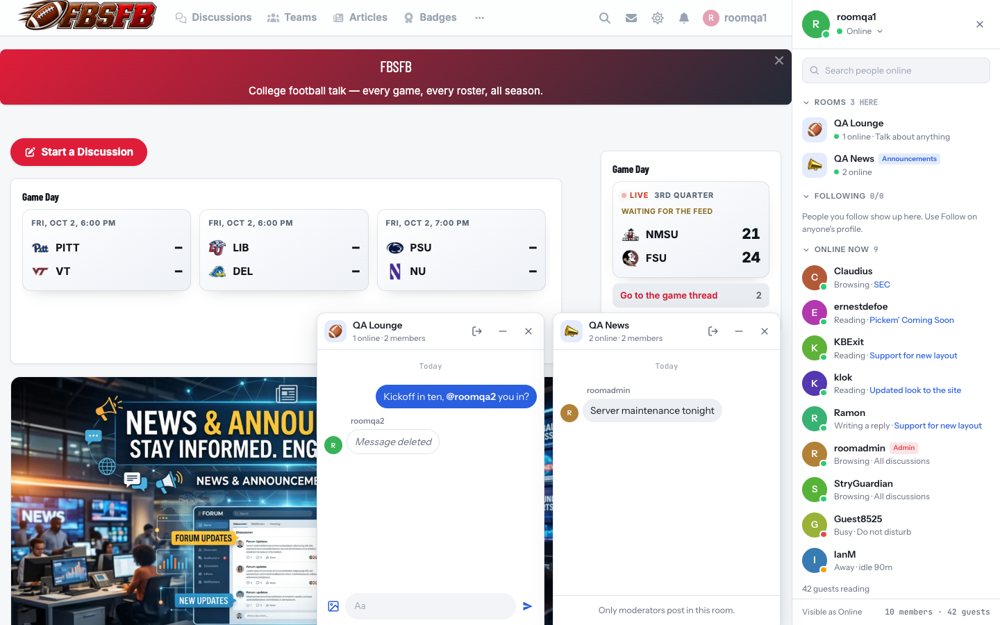

# Parley

Chat for Flarum 2. See who is online and what they are reading, message anyone in a window that stays open while you browse the forum, and talk together in rooms.



- **Who's online, live.** A panel down the side lists everyone on the forum, with their status (Online, Away, Busy, Appear offline) and what they are doing: "Reading · Ohio State at Michigan". People you follow come first. The list updates the moment someone arrives or leaves.
- **Messages that follow you.** Click anyone to open a chat window docked at the bottom of the page. Keep up to three open while you read; the rest fold down to chat heads. Typing dots, "seen", reactions, replies, pictures, edit and delete.
- **Rooms.** Chat rooms for everyone, or for exactly the people who can see a tag. Rooms can sit inside other rooms (a team's room under its conference), carry a logo, and be announcement-only.
- **A full inbox** at `/parley`, with every conversation and room.
- **Safe by default.** Block anyone, choose who can message you, report a message to the moderators. Staff never read private conversations.

**Voice and video calls**, and voice chat in rooms, are a separate add-on: **Parley Calls** (`ernestdefoe/parley-calls`). Its own README covers setting up audio and video.

---

## Contents

1. [What you need](#1-what-you-need)
2. [Install](#2-install)
3. [Realtime (recommended)](#3-realtime-recommended)
4. [Settings](#4-settings)
5. [Permissions](#5-permissions)
6. [Rooms](#6-rooms)
7. [What members can set](#7-what-members-can-set)
8. [Moderation](#8-moderation)
9. [Moving from ramon/chat](#9-moving-from-ramonchat)
10. [Performance](#10-performance)
11. [Troubleshooting](#11-troubleshooting)
12. [Privacy](#12-privacy)
13. [For developers](#13-for-developers)

---

## 1. What you need

| | |
|---|---|
| Flarum | 2.0 or later |
| PHP | 8.3 or later, with the **GD** extension (for room logos) |
| flarum/realtime | optional but recommended (section 3) |
| flarum/tags | optional; needed to tie rooms to tags |

## 2. Install

```bash
composer require ernestdefoe/parley
php flarum migrate
php flarum extension:enable ernestdefoe-parley
php flarum cache:clear
```

Run these as the web server's user (often `www-data`), not as root.

If the forum shows a 500 error straight after installing, run `composer dump-autoload` and reload PHP-FPM. That is Composer's class map catching up, not Parley.

**The inbox lives at `/parley`.** Flarum's own private-messages extension owns `/messages`, and two extensions claiming one address stop the whole forum loading, so Parley never uses it.

## 3. Realtime (recommended)

With **flarum/realtime** installed and its websocket server running, everything arrives the instant it happens: messages, typing dots, "seen", reactions, and changes to the online list.

**Without it, Parley still works**, more slowly:

| | With realtime | Without |
|---|---|---|
| New messages in an open window | instantly | within 5 seconds |
| Unread counts, chat heads | instantly | within 15 seconds |
| Online list | the moment someone arrives or leaves | every 15 seconds |
| Typing dots | yes | no |

Parley also watches the websocket itself. If realtime is installed but its connection is down, because the server stopped or is misconfigured, Parley falls back to the slower checks above until it reconnects. Nothing is lost while it is down.

Setting realtime up (the websocket server, the `config.php` block, passing `/app/` through your web server, and checking it in the browser) is covered step by step in Parley Calls' README, section 3. The same setup serves both.

To check it on your forum: sign in, open the browser console and run `app.websocket.connection.state`. It should say `connected`.

## 4. Settings

**Admin → Parley**:

| Setting | Default | |
|---|---|---|
| Rooms | — | Create and arrange rooms (section 6). |
| Minutes before Away | 10 | Someone who has not touched the page for this long shows as Away, until they come back. |
| Largest picture (MB) | 8 | The biggest picture a member can send in a conversation. |

## 5. Permissions

| Permission | Default | Means |
|---|---|---|
| Use Parley chat | Members | See the online list, message people, use rooms. Members without it see no Parley at all. |
| Hidden from the Parley online list | nobody | Members of these groups never appear in the online list, for example staff who would rather not be seen. Moderators still see them. |
| Review reported Parley messages | Moderators | See and handle reports (section 8), and remove messages in rooms. |

Suspended members cannot use Parley while their suspension lasts. Members must have confirmed their email address before they can send anything.

## 6. Rooms

Rooms are made and arranged under **Admin → Parley → Rooms**.

- **Add a room**: give it a name, and optionally a description and an emoji.
- **Who can see it**: everyone who can use Parley, or **exactly the people who can see a chosen tag**. A room tied to a staff-only tag is invisible to everyone else: not listed, not counted, and not reachable by guessing its address.
- **Announcements**: only moderators can post. Everyone else sees a note in place of the message box.
- **Sits under**: put a room inside another. On FBSFB each team's room sits under its conference's. In the online list a parent room shows how many rooms it holds and opens to show them; while it is closed, its badge counts unread messages in the rooms inside it that you have joined.
- **Logo**: upload a PNG, JPEG, WebP or GIF. Parley trims the empty space around it, centres it and stores a crisp copy on your forum (never a link to somewhere else). SVG is refused, because an SVG can carry scripts.
- **Dark mode logo**: in dark mode a room shows its dark version. Upload your own, or let Parley make one: it checks whether the logo would vanish on a dark background (black lettering, a navy shield) and, only if so, gives it a thin light outline.
- **Drag** a room to change its place in the list. A room moves among rooms at its own level; a team room stays under its conference.
- **Archive** hides a room from members but keeps everything in it; **Restore** brings it back. **Delete** removes the room and every message in it, after a confirmation. Rooms inside a deleted room move up a level rather than disappearing.

A room's face is chosen in this order: its uploaded logo, then its emoji, then its tag's icon on the tag's colour, then `#`.

Members **join** a room by opening it, which means its messages arrive live and it counts unread for them. They can leave from the room's header. An `@username` in a room alerts that person, if they can see the room.

## 7. What members can set

- **Status**: Online, Busy, or Appear offline, from the top of the online list. Away is set automatically after the idle time, and lifted when they come back. Busy keeps new conversations from popping up as chat heads. Appear offline hides them from the list while they still see everyone.
- **Who can message me**: everyone, only people they follow, or nobody. Under **Settings → Privacy**. Moderators can always message them.
- **Follow** and **Block**: from anyone's user menu. People you follow appear first in the online list. A block works both ways: neither of you can message the other or see the other online.
- Flarum's own "Allow others to see when I am online" is respected: turned off, the member is not listed.

## 8. Moderation

- **Reports.** A member can report a message from its menu. Moderators get an alert, and a **Reports** tab appears on `/parley` for them, showing the reported message and the five before it, as they were when the report was made. That is all moderators see of a private conversation.
- **Rooms are public**, so moderators can remove any message in a room. Messages in private conversations can only be removed by the person who wrote them.
- A removed message reads "Message deleted" for everyone.
- Sending is rate-limited: twenty messages in ten seconds is treated as a script, not a person.

## 9. Moving from ramon/chat

Parley can bring your ramon/chat history across:

```bash
php flarum parley:import-ramon --dry-run    # see what would come across
php flarum parley:import-ramon
```

- **Direct and group messages** become Parley conversations, with read positions kept.
- **Tag channels** become Parley rooms **tied to the same tag**, so exactly the same people can see them, with their members and messages. Announcement channels become announcement rooms; archived channels stay archived.
- Channels deleted in ramon/chat, system notices ("joined the channel") and thread replies are left out.
- It is safe to run twice: anything already imported is skipped.

Run it **before** removing ramon/chat, while its tables still exist. Then:

```bash
php flarum extension:disable ramon-chat
php flarum migrate:reset --extension=ramon-chat
composer remove ramon/chat
```

Back up ramon/chat's tables first if you might want them again: `migrate:reset` drops them.

## 10. Performance

Parley is built so a busy forum does not pay for it in requests:

- Each open page sends **one request every 30 seconds** (15 without realtime), and that one request returns the online list, the rooms and the unread counts together.
- The online list, rooms and inbox are each built in a fixed number of database queries, however many people or rooms there are.
- A parent room's inner rooms load only when someone opens it, so a forum with 150 rooms does not send all 150 to every page.
- When the online list changes, the realtime signal names nobody, and pages ask for their own list at slightly different moments rather than all at once.

## 11. Troubleshooting

| What you see | Usually |
|---|---|
| No Parley on the page | The member's group lacks **Use Parley chat**, or they are a guest. Guests are counted ("and 41 guests reading") but never shown the list. |
| Messages take a few seconds to appear | Realtime is not installed, or its websocket is not connected (section 3). |
| No typing dots | Same: typing needs a live websocket. |
| "…cannot receive messages" or "…only accepts messages from people they follow" | That member's own choices (section 7). |
| A room is missing for some members | It is tied to a tag they cannot see, or it is archived. |
| A room logo looks wrong in dark mode | Upload a **Dark mode logo** for that room. |
| Forum shows a 500 straight after installing | `composer dump-autoload`, then reload PHP-FPM (section 2). |

## 12. Privacy

- **Private conversations are private.** No admin screen shows them. Moderators see only what a member reports, and only the reported message and the five before it.
- **Pictures in conversations are private too.** They are stored outside the public web folder and served only to the people in that conversation, not merely hidden behind a hard-to-guess address.
- **What someone is reading is only shown when you can see it too.** If someone is in a discussion you cannot see, the list says "Online", not the discussion's title.
- **Guests are counted, never identified.** A guest's session is stored only as a one-way hash.
- Deleting a member's account removes them from every conversation and room; the people they talked to keep their own side of the conversation, with the deleted member's messages left unattributed.

## 13. For developers

```bash
cd js
npm install
npm run build      # js/dist is committed, and CI fails if it differs from a fresh build
npm test           # unit tests
```

`tools/rooms-e2e.mjs` drives real browsers against a local forum to test rooms and the live online list; the file explains how to run it.

Parley leaves room for other extensions to build on it; Parley Calls is built entirely this way:

- `PersonRow.prototype.actionItems()` and `ChatWindow.prototype.headerItems()`: buttons in the online list and window headers.
- `ChatWindow.prototype.bodyTopItems()`: a strip between a window's header and its messages.
- `Ernestdefoe\Parley\Rooms::$cardExtenders`: add fields to every room card, given the whole list at once.
- `Ernestdefoe\Parley\Conversations::send()`: the single path every message takes, for writing your own message types.
- `app.parley`: the client state, including `onChannel()` for binding more realtime events.

## Licence

MIT. See [LICENSE](LICENSE).
